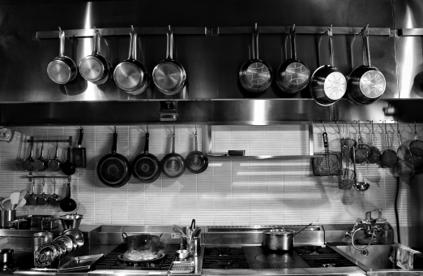
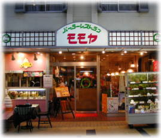

<!doctype html>
<html>
  <head>
    <title>パーラーレストラン モモヤ</title>
    <meta charset="utf-8">
    <link rel="stylesheet" href="SoldOut2_Parody.css">
  </head>
  <body>
    <header>
      

          
      

    </header>
    

      

        

        

        

          <h1>60年引き継がれる</h1>
          <h1>手作りの味</h1>
          

          

        

      

    

    

      

        

          

            

              
            

            

              
前橋のみならず県中の日常を彩った味をご賞味あれ

            

          

          

            

              

                

                  
                

                

                  
手作りのこだわり

                  
                

                
お客様により良い食事をしてほしい

                
その想いから当店ではドレッシングから

                
ケーキ、全てに至るまで

                
手作りを徹底しています

              

              

                

                  
                

                

                  
昭和31年から続く味

                  
                

                
昭和31年の創業以来飽くなき探求によって

                
より良い料理を考え抜いてきました

                
モダンとレトロの味付けを

                
心ゆくまでお楽しみください

              

              

                

                  
                

                

                  
昭和の趣くままに

                  
                

                
店内は昭和のあの頃のままに

                
若者には真新しさを

                
ご年配には懐かしさを

                
今でこそ輝く当時の空気をいつでも

              

            

          

        

      

    

    

      

        

          <h1>アクセス</h1>
          <h2>住所</h2>
          
〒371-0022

          
前橋市千代田町2-12-2

          

          <h2>電話番号</h2>
          
027-231-5017

          

          <h2>営業時間</h2>
          
am10:00～pm7:30

          
休日：毎週水曜日

        

      

    

    <footer>
      

        
        

      

    </footer>
    <!-- コメントやで -->

  </body>
</html>
